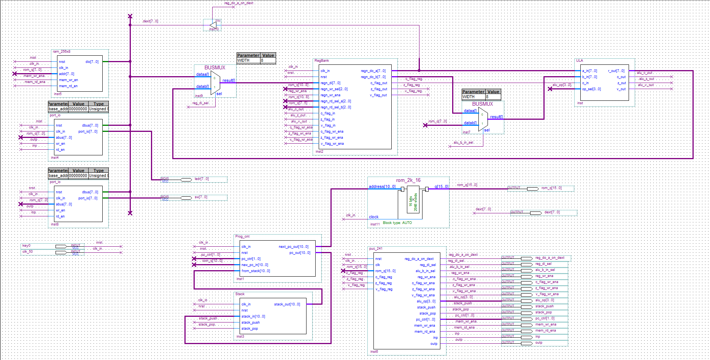

---

# Processador PUC-241

## Descrição

Todas as instruções do PUC-241 têm 16 bits de comprimento. O formato de codificação dessas instruções é variável, dependendo do tipo da instrução.

## Formatos de Instrução

### Instruções que Envolvem a ALU e Dois Registradores (Reg-Reg)

Formato:
- 2 bits: `00`
- 3 bits: operação selecionada (op)
- 3 bits: RA (registrador A)
- 3 bits: RB (registrador B)
- 5 bits: não utilizados (`xxxxx`)

Os três bits de RA e RB indicam o registrador, variando de `000` para R0 até `111` para R7. O resultado da operação é sempre armazenado em RA. As operações são definidas conforme a tabela a seguir:

| Instrução | Operação                   | op  |
|-----------|----------------------------|-----|
| AND       | AND lógico bit a bit       | 000 |
| OR        | OR lógico bit a bit        | 001 |
| XOR       | XOR lógico bit a bit       | 010 |
| MOV       | Mover de um registrador para outro | 011 |
| ADD       | Soma sem carry in          | 100 |
| ADDC      | Soma com carry in          | 101 |
| SUB       | Subtração sem carry in     | 110 |
| SUBC      | Subtração com carry in     | 111 |

- **Flag Z**: Vai para ‘1’ se o resultado da operação for zero, caso contrário vai para ‘0’.
- **Flag C**: Para ADD e ADDC, é o carry out da adição. Para SUB e SUBC, é o borrow out da subtração. Para operações lógicas e MOV, é sempre ‘0’.
- **Flag V**: Atualizado em operações aritméticas. Vai para ‘1’ quando há overflow, caso contrário vai para ‘0’.

### Instruções que Envolvem a ALU e um Valor Imediato (Reg-Immed)

Formato:
- 2 bits: `01`
- 3 bits: operação selecionada (op)
- 3 bits: RA (registrador A)
- 8 bits: constante

| Instrução | Operação                   | op  |
|-----------|----------------------------|-----|
| ANDI      | AND lógico bit a bit       | 000 |
| ORI       | OR lógico bit a bit        | 001 |
| XORI      | XOR lógico bit a bit       | 010 |
| MOVI      | Mover valor para um registrador | 011 |
| ADDI      | Soma sem carry in          | 100 |
| ADDIC     | Soma com carry in          | 101 |
| SUBI      | Subtração sem carry in     | 110 |
| SUBIC     | Subtração com carry in     | 111 |

O comportamento dos flags é o mesmo para as instruções Reg-Reg.

### Instruções que Envolvem a ALU e Apenas um Registrador

Formato:
- 2 bits: `10`
- 3 bits: operação selecionada (op)
- 3 bits: RA (registrador A)
- 8 bits: não utilizados (`xxxxxxxx`)

| Instrução | Operação                   | op  |
|-----------|----------------------------|-----|
| RL        | Rotação para esquerda      | 000 |
| RR        | Rotação para direita       | 001 |
| RLC       | Rotação para esquerda através do carry | 010 |
| RRC       | Rotação para direita através do carry | 011 |
| SLL       | Deslocamento para esquerda lógico | 100 |
| SRL       | Deslocamento para esquerda aritmético | 101 |
| SRA       | Deslocamento para direita lógico | 110 |
| NOT       | Complemento (inverte todos os bits) | 111 |

- **Flag Z**: Vai para ‘1’ se o resultado da operação for zero, caso contrário vai para ‘0’.
- **Flag V**: Não é modificado.
- **Flag C**: Ajustado de acordo com o valor do bit de saída do deslocamento ou rotação, exceto na operação NOT, onde permanece inalterado.

### Instruções de Memória e E/S

Formato:
- 3 bits: `110`
- 2 bits: operação selecionada (op)
- 3 bits: RA (registrador A)
- 4 bits: endereço

| Instrução | Operação                          | op  |
|-----------|-----------------------------------|-----|
| LDM       | Carrega um dado da memória para o registrador | 00  |
| STM       | Armazena um dado do registrador na memória | 01  |
| INP       | Entrada da porta                  | 10  |
| OUT       | Saída para porta                  | 11  |

Os flags Z, C e V não são afetados por essas instruções.

### Instruções de Desvio Incondicional e Chamada de Sub-Rotina

Formato:
- 4 bits: `1110`
- 1 bit: operação selecionada (op)
- 11 bits: endereço

| Instrução | Operação              | op  |
|-----------|-----------------------|-----|
| JMP       | Desvio incondicional  | 0   |
| CALL      | Chamada de sub-rotina | 1   |

Os flags Z, C e V não são afetados por essas instruções.

### Instruções de Salto Condicional

Formato:
- 5 bits: `11110`
- 2 bits: operação selecionada (op)
- 9 bits: não utilizados (`xxxxxxxxx`)

| Instrução | Operação                    | op  |
|-----------|-----------------------------|-----|
| SKIPC     | Salta se carry (C = ‘1’)    | 00  |
| SKIPZ     | Salta se zero (Z = ‘1’)     | 01  |
| SKIPV     | Salta se overflow (V = ‘1’) | 10  |

Os flags Z, C e V não são afetados por essas instruções.

### Instrução de Retorno

Formato:
- 5 bits: `11110`
- 2 bits: operação selecionada (op)
- 9 bits: não utilizados (`xxxxxxxxx`)

| Instrução | Operação              | op  |
|-----------|-----------------------|-----|
| RET       | Retorno de sub-rotina | 11  |

Os flags Z, C e V não são afetados por essa instrução.

### Instrução NOP

Formato:
- 5 bits: `11111`
- 11 bits: não utilizados (`xxxxxxxxxxx`)

Essa instrução não tem efeito algum. O programa continua normalmente com a instrução seguinte. Nenhum flag é afetado por essa instrução.

## Observações

1. Em todas as instruções que operam registradores, RA é sempre especificado pelos bits 10 a 8 da palavra de instrução e RB pelos bits 7 a 5.
2. Para a decodificação das instruções, o bloco de controle deverá receber os bits 15 a 9 da palavra de instrução.

## Esquema do Processador

## Código VHDL

O código VHDL do processador pode ser encontrado no arquivo [puc241.vhd](./puc_241.vhd).

## Explicação do Código VHDL

O código VHDL implementa o processador PUC-241, que é capaz de executar uma variedade de instruções. Aqui estão algumas das principais partes do código:

- **Declaração dos Sinais e Constantes**: São declaradas constantes para identificar cada tipo de instrução e as operações da ALU. Sinais são usados para armazenar os bits que representam os registradores e as instruções.

- **Processo Principal**: O processo principal é sensível ao clock (`clk`) e ao sinal de reset (`nrst`). Quando o sinal de reset está ativo, todos os sinais de controle são zerados. Na borda de subida do clock, a instrução é decodificada e os sinais de controle são ajustados de acordo com o tipo de instrução e operação.

- **Decodificação da Instrução**: A instrução é decodificada usando estruturas `if-else if`, que verificam os bits mais significativos para determinar o tipo de instrução e, em seguida, os bits de operação para determinar a operação específica.

- **Execução da Instrução**: Dependendo do tipo de instrução, os sinais de controle apropriados são ativados para realizar a operação desejada, como leitura/escrita de memória, operações aritméticas/lógicas, saltos condicionais, entre outros.

Para mais detalhes, consulte o código completo no arquivo [puc241.vhd](./puc_241.vhd).

---
